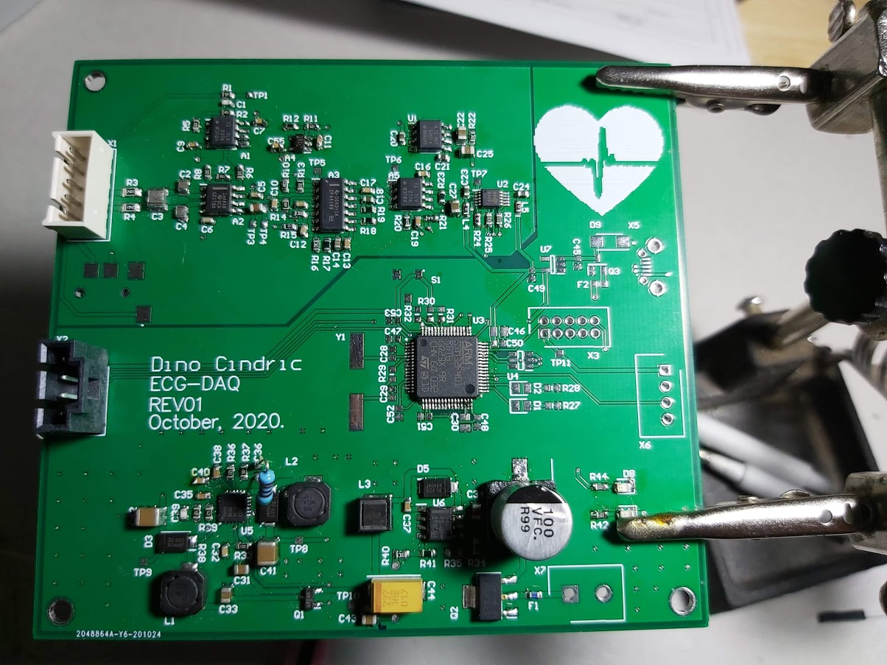

# ECG-DAQ

ECG-DAQ is the data acquisition system for electrocardiogram signals. This project is built from scratch meaning that all that schematics and PCB is made by myself based on the reference designs, simulations and laboratory testing on prototypes. 

PCB is logically/phisically divided into two parts - precision analog section where input signals, coming from the electrodes (left and right arm, right leg), are conditioned and digital section used for signal processing and data transmission. 

Input signal conditioning includes:
* RFI/EMI differential filtering
* First gain stage using instrumentation amplifier INA818
* High-pass filtering implemented with 1st order C-R network 
* Second gain stage
* 5th order active Butterworth low-pass filter
* Precision ADC input preconditioning - voltage follower + antialiasing filtering
* ADCs voltage reference with driver circuit

Digital section is based on STM32F407 MCU and it's used for acquiring signals from ADC using 3-Wire SPI protocol, USB, I2C and UART communication with external devices and for executing various signal processing algorithms on acquired data (e.g. Pan-Tompkins). 

## Usage

Project files, including schematic and PCB documents, need to be opened with Altium Designer. Gerber files are production-ready and can be reviewed with various free alternative tools. 

**Disclaimer**: This project is work in progress. Use the files, hardware, and software given in this repository at your own risk.

## Updates
 * With power supply section completely soldered, negative voltage at TPS65130 regulator gave unstable, pulsating voltage, from -19 V up to -4 V.  The main reason for that behavior is that noise coupled into negative feedback pin (FBN) can be too large. This type of problem is well known for  this specific regulator and the solution is to add 51k resistor between C29 (16pF) capacitor and negative voltage rail. More discussion about this can be found here:
	* https://e2e.ti.com/support/power-management/f/power-management-forum/750348/tps65130-negative-supply-of-the-tps65130-is-not-regulating
	* https://e2e.ti.com/support/power-management/f/power-management-forum/727069/tps65130-inverting-converter-is-not-regulating-under-load
 * For some reason, I've received ADC's voltage reference driver opamp OPA2350 in wrong footprint. On the current prototyping board I've decided to solder TLV2376 opamp instead of OPA2350, since it's specifications should be good enough for ADC's voltage reference driver.
 * Initial testing of so-far-assembled board (only MCU section is not soldered yet) gave promising results.  More detailed test will be done after complete board assembly - basic functionalities of analog section are tested (signal amplification, filtering) and do perform well. Currently assembled parts of the board can be seen on the picture below.

**NOTE:** All component values and designators refer to ECG-DAQ schematic version 1.0, which can be found in Hardware/ProjectOutputs directory of this project.

## Contributing
I'm currenlty writing firmware for the made PCB. It is very likely that there will be several versions of this project, so for any major or minor changes you would like to implement yourself, please open an issue so we can discuss about it or alternatively send me an email: dino.cindric@fer.hr.

Thank you.

## License
[MIT](https://choosealicense.com/licenses/mit/) Copyright (c) 2020, Dino Cindrić - All rights reserved.